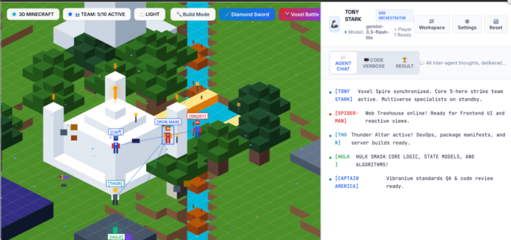

<p align="center">
  <a href="https://github.com/shubhransh-gupta/scavengers-assemble/stargazers">
    
  </a>
  <a href="https://github.com/shubhransh-gupta/scavengers-assemble/network/members">
    
  </a>
  <a href="https://github.com/shubhransh-gupta/scavengers-assemble/issues">
    
  </a>
  <a href="https://github.com/shubhransh-gupta/scavengers-assemble/blob/main/LICENSE">
    
  </a>
  = 18.0.0-FFC107?style=for-the-badge&logo=node.js&labelColor=030712" alt="Node" />
  
</p>

<p align="center">
  
  
  
  
  
</p>

```
  ███████╗ ██████╗ █████╗ ██╗   ██╗███████╗███╗   ██╗ ██████╗ ███████╗██████╗ ███████╗
  ██╔════╝██╔════╝██╔══██╗██║   ██║██╔════╝████╗  ██║██╔════╝ ██╔════╝██╔══██╗██╔════╝
  ███████╗██║     ███████║██║   ██║█████╗  ██╔██╗ ██║██║  ███╗█████╗  ██████╔╝███████╗
  ╚════██║██║     ██╔══██║╚██╗ ██╔╝██╔══╝  ██║╚██╗██║██║   ██║██╔══╝  ██╔══██╗╚════██║
  ███████║╚██████╗██║  ██║ ╚████╔╝ ███████╗██║ ╚████║╚██████╔╝███████╗██║  ██║███████║
  ╚══════╝ ╚═════╝╚═╝  ╚═╝  ╚═══╝  ╚══════╝╚═╝  ╚═══╝ ╚═════╝ ╚══════╝╚═╝  ╚═╝╚══════╝
           ⚡ S C A V E N G E R S   A S S E M B L E ⚡
```

<p align="center">
  <strong>Earth's Mightiest Agentic AI Coding War Room & 3D Minecraft Engine</strong><br/>
  <em>Turning Your Existing AI Models into an Autonomous Superhero Strike Team</em><br/>
  <strong>Crafted with ❤️ by <a href="https://shubhransh-gupta.github.io/cv/">Shubhransh Gupta</a></strong>
</p>

<p align="center">
  <a href="https://github.com/shubhransh-gupta/scavengers-assemble/stargazers">
    
  </a>
</p>

---

## 📸 Product Showcase

<p align="center">
  
</p>

<p align="center">
  <em>Figure 1: 100% 3D Isometric Minecraft Simulation with Taj Mahal, River Wooden Bridges, 5 Core Avengers & Clean Light Theme.</em>
</p>

---

## 🌐 Online Showcase & Local Architecture

| Platform | Location | What It Does |
| :--- | :--- | :--- |
| 🚀 **Public Marketing Site** | [**View Live Showcase**](https://shubhransh-gupta.github.io/scavengers-assemble/) | Futuristic landing page showcasing superhero multi-agent architecture, provider benchmarks, and quickstart guide. |
| 🖥️ **Local Product App** | `http://localhost:3000/` | **Interactive 3D Minecraft Mission Control HUD** — Live code execution, JARVIS voice comms, workspace file generator, and DAG visualizer. |
| 📁 **GitHub Repository** | [**Source Code**](https://github.com/shubhransh-gupta/scavengers-assemble) | Full TypeScript source code, tests, and CLI binary. |

---

## 💡 What is Scavengers Assemble?

> *"And if we can't protect your codebase, you can be damn well sure we'll avenge it."*  
> — **Tony Stark**

**Scavengers Assemble** is a **free, open-source, multi-agent AI coding orchestrator**. Instead of interacting with a single chatbot window, Scavengers turns your AI models into a **collaborative superhero strike team**:

1. **You give a master directive** (e.g., *"Build a high-speed Express JWT authentication backend with unit tests"* or tap **`🎙️ Comms`** to speak in Hindi/English).
2. **Tony Stark** deconstructs your objective into an asynchronous Directed Acyclic Graph (DAG).
3. **5 Core Heroes execute in parallel**:
   * 🦾 **Tony Stark (Lead Architect)**: Deconstructs requirements, formulates files, and delegates tasks.
   * 🕸️ **Spider-Man (Frontend UI)**: Crafts clean, responsive React & SwiftUI views and components.
   * ⚡ **Thor (DevOps & Builds)**: Generates package manifests (`package.json`, `Package.swift`), Dockerfiles, and CI pipelines.
   * 🟢 **The Hulk (Core Logic)**: Smells bottlenecks and writes state models, algorithms, and services.
   * 🛡️ **Captain America (Vibranium QA)**: Enforces strict typing, runs boundary unit tests, and verifies standards compliance.
4. **Multiverse Specialists on Reserve**: Spawn **Stephen Strange** (Temporal Memory & AST), **Doctor Doom** (Compilers), **Thanos** (Rate Balancer), **Kang** (Timeline Simulation), or **Black Widow** (Security & CVEs) on demand whenever extra expertise is needed!
5. **Real Code Written to Disk**: Full runnable project repositories are saved directly to `./workspace/<slug>/` with copyable terminal run scripts (`npm install && npm start`).

---

## 🎮 Key Features & Innovations

### 1. 🌍 100% 3D Isometric Minecraft Simulation
* Pure-code HTML5 Canvas isometric voxel world covering 360° lateral elevation and depth.
* **Taj Mahal of India**, **Valyrian Nether Lava Keep**, **Stark Voxel Tower**, and multi-block voxel trees.
* **Oak Wooden River Bridges** with guard rails so characters cross over water smoothly.
* **Pan & Zoom**: Click and drag to pan across the landscape; mouse wheel to zoom.

### 2. 🔨 Minecraft Creative Build Mode
* Tap **`[ 🔨 Build Mode ]`** to activate creative building.
* **Ghost Preview**: See a translucent preview of the block under your cursor.
* **Left-Click to Place**: Place blocks directly from your hotbar (`Oak Planks`, `Quartz`, `Stone`, `Diamond Block`, `Obsidian`, `Lava`, `Water`).
* **Right-Click to Break**: Mine and crumble blocks with stone voxel particle FX.

### 3. 📁 Interactive Workspace File Explorer
* Tapping **`📁 Workspace`** opens a graphical file explorer modal:
  * Browse all generated repositories on your local disk.
  * Inspect syntax-highlighted code for any generated file.
  * One-click **`[ Copy Disk Path ]`**, **`[ Copy File ]`**, and **`[ Copy Run Script ]`** buttons.

### 4. 🎙️ JARVIS Voice Comms & Audio Translation
* Tap **`🎙️ Comms`** to speak your directive directly into your microphone.
* Speak in **Hindi, English, Spanish, or any language**.
* Built-in AI translation automatically refines spoken words into crisp, production-grade engineering directives before dispatching.

### 5. 🎨 Daylight, Light & Dark Multi-Theme Engine
* Switch between **☀️ Daylight Theme** (ultra-bright white & sky blue), **⛅ Modern Slate** (Linear-style soft light), and **🌙 Dark Stark HUD** (deep space obsidian with neon Arc Reactor glow).
* Persists instantly in `localStorage`.

### 6. 🔑 Live API Key Health & Latency Verification
* Centralized **`⚙️ Settings`** dialog with real-time connection status badges for Google Gemini, Anthropic Claude, OpenAI, and local Ollama.
* Tap **`⚡ Test Key`** to run a live health check with millisecond ping latency reporting.

### 7. 🧠 Personal Custom Skills Loader
* Register custom capabilities, architectural rules, and prompt plugins directly into the Avengers harness (e.g. *"Clean Code & SOLID Architecture"*, *"Custom GraphQL Schema Generator"*).

---

## ⚡ Quickstart & Installation

### Option 1: Global CLI Launch (Recommended)
```bash
# Clone the repository
git clone https://github.com/shubhransh-gupta/scavengers-assemble.git
cd scavengers-assemble

# Install dependencies and build TypeScript
npm install
npm run build

# Launch Stark Mission Control HUD
node bin/stark.js hud --port 3000
```
Open **`http://localhost:3000/`** in your browser to launch the 3D Minecraft Mission Control War Room!

---

### Option 2: CLI Autonomous Mission Runner
Run missions directly in your terminal:
```bash
# Run a one-shot mission
node bin/stark.js mission "Create a SwiftUI Weather application with glassmorphic cards"

# Check system health & registered heroes
node bin/stark.js status
```

---

## 🏗️ Project Architecture

```
scavengers-assemble/
├── bin/
│   └── stark.js                     # Global executable CLI binary
├── src/
│   ├── index.ts                     # Core SDK entrypoint
│   ├── config.ts                    # Stark Tower & Arc Reactor configuration
│   ├── types.ts                     # TypeScript definitions & Hero contracts
│   ├── core/
│   │   ├── stark-orchestrator.ts    # GOD DAG mission decomposition & synthesis
│   │   ├── arc-reactor.ts           # Token balancer & multi-provider router
│   │   ├── stark-comms.ts           # Inter-agent mesh communication bus
│   │   └── workspace-generator.ts   # Local disk code generator & manifests
│   ├── heroes/
│   │   ├── base-hero.ts             # Base superhero agent class
│   │   ├── tony-stark.ts            # Iron Man (Lead Orchestrator)
│   │   ├── spider-man.ts            # Spider-Man (Frontend UI)
│   │   ├── thor.ts                  # Thor (DevOps & Builds)
│   │   ├── hulk.ts                  # Hulk (Core Logic & State)
│   │   ├── captain-america.ts       # Captain America (Vibranium QA)
│   │   └── doctor-strange.ts        # Doctor Strange (Temporal AST)
│   ├── providers/                   # Gemini, Claude, OpenAI, Ollama adapters
│   └── server/
│       └── mission-control-server.ts# Express + WebSocket Mission Control server
├── docs/
│   ├── index.html                   # Public Marketing Landing Page (GitHub Pages)
│   ├── warroom.html                 # 100% 3D Minecraft Mission Control War Room
│   ├── warroom.js                   # Isometric canvas engine & controllers
│   ├── warroom.css                  # Daylight, Light & Dark Theme CSS
│   └── assets/                      # Hero avatars & screenshots
├── workspace/                       # Generated user codebases on local disk
└── package.json
```

---

## 🤝 Contributing

Contributions from the developer multiverse are welcome!
1. Fork the repo: `https://github.com/shubhransh-gupta/scavengers-assemble`
2. Create your feature branch: `git checkout -b feature/amazing-superpower`
3. Commit your changes: `git commit -m 'feat: add Wolverine AST debugger'`
4. Push to branch: `git push origin feature/amazing-superpower`
5. Open a Pull Request!

---

## 📜 License

Distributed under the **MIT License**. See `LICENSE` for more information.

---

<p align="center">
  <strong>Scavengers Assemble</strong> · Developed by <a href="https://shubhransh-gupta.github.io/cv/"><strong>Shubhransh Gupta</strong></a><br/>
  <em>"Earth's Mightiest Agentic AI Coding War Room."</em>
</p>
